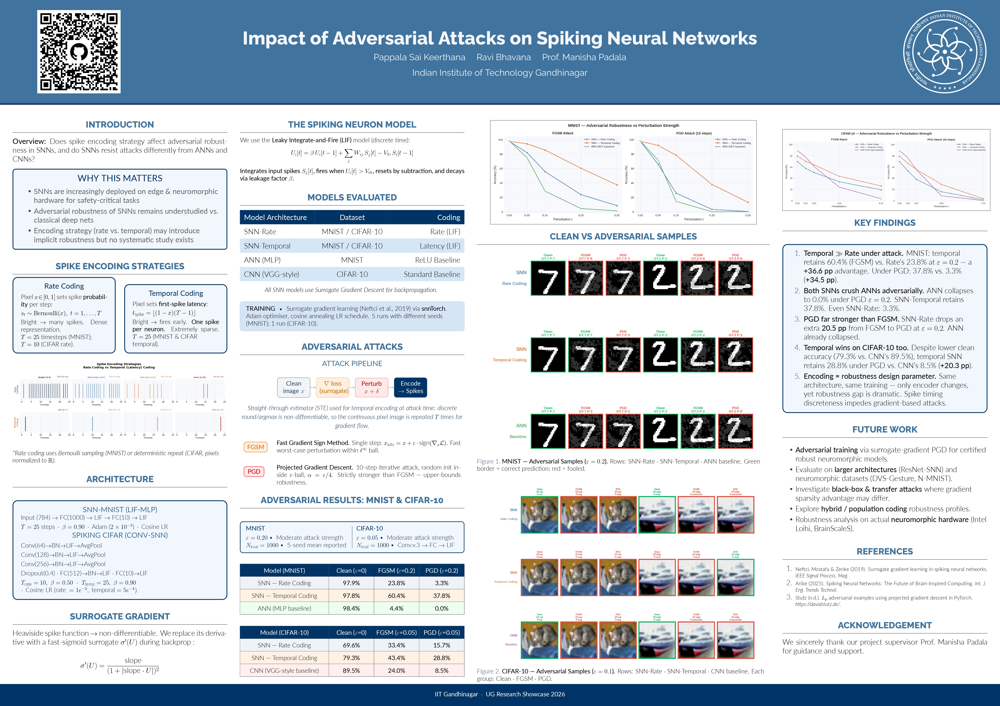

# Impact of Adversarial Attacks on Spiking Neural Networks

> **UG Research Project — IIT Gandhinagar · UG Research Showcase 2026**  
> Pappala Sai Keerthana &nbsp;·&nbsp; Ravi Bhavana &nbsp;·&nbsp; Supervisor: Prof. Manisha Padala

---

## Research Poster

<p align="center">
  
</p>

> Full PDF: [`poster/snn_project_poster.pdf`](poster/snn_project_poster.pdf)

---

## The Story: How This Project Evolved

This project didn't start with a clean research question — it grew through exploration. Here's the honest account of how it went.

### Phase 1 — Learning SNNs: Training from Scratch

The first step was just getting Spiking Neural Networks to work at all. Spiking Neural Networks are fundamentally different from regular deep learning models: instead of continuous activations, neurons communicate through discrete spikes over time, mimicking how biological neurons behave. We built LIF (Leaky Integrate-and-Fire) neuron models using `snnTorch`, trained an SNN on MNIST and CIFAR-10, and got a feel for the dynamics — the membrane potential accumulation, the firing threshold, the temporal dimension `T` that standard neural nets don't have.

The training challenge here is non-trivial: the Heaviside spike function is non-differentiable, so standard backpropagation can't be used directly. The solution is **surrogate gradient descent**, where you replace the derivative of the spike function with a smooth approximation (we used a fast-sigmoid with slope=25) during the backward pass only. Getting this right and achieving competitive clean accuracy on both datasets was the foundation of everything that followed.

### Phase 2 — The First Adversarial Experiments (Messy but Revealing)

Once we had working SNN models, the natural next question was: *how do these hold up under adversarial attack?* We implemented **FGSM** (Fast Gradient Sign Method) and **PGD** (Projected Gradient Descent) — the two most widely used gradient-based adversarial attacks — and applied them to our trained SNNs.

We also trained ANN (MLP) and CNN baselines and attacked those too, to get a point of comparison. These experiments were run in separate notebooks, one per model/dataset combination — messy, scattered, and hard to compare directly. But the pattern was immediately striking: SNNs seemed to resist the attacks far better than the ANN and CNN baselines, even without any adversarial training. Why? We didn't fully understand it yet.

At this stage we had a signal, but not a clean story. The experiments needed structure.

### Phase 3 — Rate vs Temporal: A Cleaner Study (The Final Version)

After the first round of experiments, we went back and restructured the entire project around one central question:

> **Does the spike encoding strategy determine adversarial robustness?**

We identified two fundamentally different ways to convert an image into spikes:

- **Rate coding** — each pixel's value sets the probability of spiking at each timestep. A pixel with value 0.9 fires roughly 90% of the time. This creates a smooth, dense, gradient-friendly representation.
- **Temporal (latency) coding** — each pixel fires exactly once, and the timing of that spike encodes its value. Brighter pixels fire earlier. This is sparse, discrete, and hard to differentiate through.

We hypothesized that the discreteness of temporal coding would make gradient-based attacks less effective — because the discrete floor function used to compute spike latency introduces a discontinuity that the Straight-Through Estimator (STE) can only approximate at attack time.

We rebuilt everything into **one clean unified notebook**, trained both coding variants against proper baselines (ANN for MNIST, VGG-style CNN for CIFAR-10), ran FGSM and PGD at controlled perturbation budgets, and generated 15 publication-quality figures. The results were dramatic and consistent across both datasets.

### Phase 4 — Poster & Showcase

We compiled the findings into a 4-column A1 landscape research poster using the **Gemini Beamer LaTeX theme** with a custom IITGN blue color scheme. The poster was presented at the IIT Gandhinagar UG Research Showcase 2026. The full LaTeX source is included in this repository.

---

## What Are Spiking Neural Networks?

Traditional ANNs and CNNs process information as continuous real-valued activations. **Spiking Neural Networks (SNNs)** process information as binary events in time — spikes. A neuron integrates incoming spikes, and when its membrane potential crosses a threshold, it fires (emits a spike of its own) and resets.

We use the **Leaky Integrate-and-Fire (LIF)** model:

```
U_i[t] = β · U_i[t-1]  +  Σ_j W_ij · S_j[t]  −  V_th · S_i[t-1]
```

where `U_i[t]` is the membrane potential at time `t`, `β` is the leak (decay) factor, `S_j[t]` are incoming spikes, and `V_th` is the firing threshold. When `U_i[t] > V_th`, the neuron fires (`S_i[t] = 1`) and the membrane resets by subtraction.

SNNs are naturally suited for neuromorphic hardware (Intel Loihi, BrainScaleS) and are increasingly being deployed in edge/real-time settings — which makes understanding their adversarial robustness critically important.

---

## Spike Encoding Strategies

Converting a static image into spike trains is a design choice with significant downstream consequences.

### Rate Coding

Each pixel value `x ∈ [0, 1]` sets the probability of spiking at each timestep:

```
s_t ~ Bernoulli(x),    t = 1, ..., T
```

A bright pixel (x = 0.9) fires roughly 90% of timesteps. A dark pixel (x = 0.1) fires rarely. The representation is **dense** and provides a smooth, differentiable-friendly mapping from pixel values to network inputs.

*T = 25 timesteps (MNIST) · T = 10 timesteps (CIFAR-10 rate)*

### Temporal (Latency) Coding

Each pixel fires exactly once. The timing of that spike encodes its value:

```
t_spike = floor((1 − x) · (T − 1))
```

Bright pixels fire early; dark pixels fire late. Only **one spike per neuron** is ever emitted — this is an extremely sparse representation. The floor function introduces hard discretization, which creates a fundamental difficulty for gradient-based attackers: to compute attack gradients, we must approximate this non-differentiable step using the **Straight-Through Estimator (STE)**, which treats the gradient of the discrete operation as if it were the identity. This approximation degrades attack quality.

*T = 25 timesteps (MNIST & CIFAR-10 temporal)*

---

## Architecture

### SNN-MNIST (LIF-MLP)

```
Input (784) → FC(1000) → LIF → FC(10) → LIF
```

- T = 25 timesteps · β = 0.90 · Adam, lr = 2×10⁻³ · Cosine LR annealing
- 5 training runs with different random seeds (mean reported)

### Conv-SNN for CIFAR-10

```
Conv(64)  → BN → LIF → AvgPool
Conv(128) → BN → LIF → AvgPool
Conv(256) → BN → LIF → AvgPool
Dropout(0.4) → FC(512) → BN → LIF → FC(10) → LIF
```

**Rate version:** T = 10, β = 0.50, lr = 1×10⁻³  
**Temporal version:** T = 25, β = 0.90, lr = 5×10⁻⁴

Both trained with Cosine LR annealing via `snnTorch`.

### Baselines

| Model | Dataset | Architecture |
|---|---|---|
| ANN (MLP) | MNIST | FC(784→1000→10), ReLU |
| CNN (VGG-style) | CIFAR-10 | 3×Conv block → FC → Softmax |

---

## Adversarial Attacks

### Attack Pipeline

```
Clean image x  →  Compute ∇ loss (surrogate grad)  →  Perturb x + δ  →  Encode → Spikes
```

For temporal encoding at attack time: since the discrete floor/argmax is non-differentiable, the **Straight-Through Estimator (STE)** is used — treating the continuous pixel image repeated T times as the gradient path.

### FGSM — Fast Gradient Sign Method

Single-step attack:

```
x_adv = x + ε · sign(∇_x L(f(x), y))
```

Fast, computes in one forward+backward pass. Provides a lower bound on adversarial robustness.

### PGD — Projected Gradient Descent

Iterative 10-step attack with random initialization inside the ε-ball:

```
x^(k+1) = Proj_{x + ε·B∞} [ x^(k) + α · sign(∇_x L) ]
```

where α = ε/4. Strictly stronger than FGSM — PGD is the de facto standard for adversarial robustness evaluation and provides a tight upper bound. If a model breaks under PGD, it's genuinely vulnerable.

---

## Results

### MNIST (ε = 0.20, N_eval = 1000, 5-seed mean)

| Model | Clean (ε=0) | FGSM (ε=0.2) | PGD (ε=0.2) |
|---|:---:|:---:|:---:|
| SNN — Rate Coding | 97.9% | 23.8% | 3.3% |
| **SNN — Temporal Coding** ★ | **97.8%** | **60.4%** | **37.8%** |
| ANN (MLP baseline) | 98.4% | 4.4% | 0.0% |

### CIFAR-10 (ε = 0.05, N_eval = 1000)

| Model | Clean (ε=0) | FGSM (ε=0.05) | PGD (ε=0.05) |
|---|:---:|:---:|:---:|
| SNN — Rate Coding | 69.6% | 33.4% | 15.7% |
| **SNN — Temporal Coding** ★ | **79.3%** | **43.4%** | **28.8%** |
| CNN (VGG-style baseline) | 89.5% | 24.0% | 8.5% |

★ = strongest adversarial robustness across all conditions.

---

## Key Findings

**1. Temporal coding dramatically outperforms rate coding under attack.**  
On MNIST at ε=0.2: temporal retains 60.4% under FGSM vs rate's 23.8% — a **+36.6 pp** gap. Under PGD: 37.8% vs 3.3% (**+34.5 pp**). The discreteness of spike timing makes gradient-based attack directions unreliable.

**2. Both SNNs outperform ANNs/CNNs adversarially — by a large margin.**  
The ANN collapses entirely to 0.0% under PGD (ε=0.2). SNN-Temporal holds 37.8%. Even the weaker SNN-Rate holds 3.3%. On CIFAR-10, the CNN drops to 8.5% under PGD while SNN-Temporal retains 28.8% (+20.3 pp). This happens despite the CNN having higher *clean* accuracy (89.5% vs 79.3%).

**3. PGD is dramatically more effective than FGSM.**  
SNN-Rate drops an extra 20.5 pp moving from FGSM to PGD on MNIST. The single-step FGSM estimate is optimistic — PGD gives a tighter, more realistic picture of true robustness.

**4. Encoding strategy is a first-class robustness design parameter.**  
Same architecture. Same training procedure. Same optimizer and hyperparameters. Only the spike encoder changes — yet the robustness gap is dramatic and consistent across both datasets. When deploying SNNs on neuromorphic hardware for safety-critical tasks, encoding strategy should be chosen with adversarial robustness in mind, not just accuracy.

**5. Why does temporal coding resist attacks better?**  
Rate coding maps pixel values to Bernoulli probabilities — a smooth, differentiable surface that gradient-based attacks can easily exploit. Temporal coding introduces a hard `floor()` discretization: the first-spike latency is a step function of pixel value. When computing attack gradients, the STE approximation used for this non-differentiable step is lossy, degrading the attack's ability to find effective adversarial directions.

---

## Project Structure

```
adversarial-attacks-on-snns/
│
├── notebooks/
│   ├── snn_adversarial_attacks.ipynb       ← Main unified notebook (final version)
│   └── exploratory/                        ← Earlier phase-by-phase experiments
│       ├── snn_mnist.ipynb                   Phase 1: SNN training on MNIST
│       ├── snn_cifar10_initial.ipynb         Phase 1: SNN training on CIFAR-10
│       ├── snn_mnist_adversarial_v1.ipynb    Phase 2: First attack experiments
│       ├── snn_mnist_adversarial_comparision.ipynb
│       ├── snn-cifar10-adversarial.ipynb
│       ├── ann-mnist-adversarial.ipynb       Phase 2: ANN baseline attacks
│       ├── ann-cifar10-adversarial.ipynb
│       ├── cnn-mnist-adversarial.ipynb       Phase 2: CNN baseline attacks
│       └── cnn-cifar10-adversarial.ipynb
│
├── models/                                 ← Pre-trained weights (.pt files)
│   ├── snn_rate_mnist.pt                     SNN-Rate on MNIST (97.9% clean)
│   ├── snn_temporal_mnist.pt                 SNN-Temporal on MNIST (97.8% clean)
│   ├── snn_rate_cifar.pt                     SNN-Rate on CIFAR-10 (69.6% clean)
│   ├── snn_temporal_cifar.pt                 SNN-Temporal on CIFAR-10 (79.3% clean)
│   ├── ann_mnist.pt                          ANN baseline on MNIST (98.4% clean)
│   ├── cnn_cifar.pt                          CNN baseline on CIFAR-10 (89.5% clean)
│   └── README.md
│
├── figures/                                ← All 15 generated plots
│   ├── fig01_encoding_comparison.png         Rate vs temporal encoding visualization
│   ├── fig02_mnist_learning_curves.png       MNIST training curves
│   ├── fig02b_mnist_train_vs_test.png
│   ├── fig03_cifar_learning_curves.png       CIFAR-10 training curves
│   ├── fig03b_cifar_train_vs_test.png
│   ├── fig04_mnist_robustness.png            MNIST robustness vs ε sweep
│   ├── fig05_cifar_robustness.png            CIFAR-10 robustness vs ε sweep
│   ├── fig06_results_tables.png              Summary tables
│   ├── fig07_grouped_bar.png                 Grouped bar chart comparison
│   ├── fig08_degradation_heatmap.png         Accuracy degradation heatmap
│   ├── fig09_mnist_adv_samples.png           MNIST adversarial sample grid
│   ├── fig10_cifar_adv_samples.png           CIFAR-10 adversarial sample grid
│   ├── fig11_perturbation_noise.png          Perturbation noise visualization
│   ├── fig12_spike_activity.png              Spike activity analysis
│   ├── fig13_confidence_dist.png             Confidence distribution under attack
│   ├── fig14_mnist_per_class.png             Per-class accuracy (MNIST)
│   └── fig15_cifar_per_class.png             Per-class accuracy (CIFAR-10)
│
├── poster/
│   ├── snn_project_poster.pdf              ← Final compiled A1 landscape poster
│   └── latex_source/                       ← Full LaTeX source (Gemini Beamer theme)
│       ├── snn_poster.tex                    Main poster .tex file
│       ├── beamerthemegemini.sty             Gemini Beamer theme
│       ├── colorthemes/                      Available color theme variants
│       ├── poster.bib                        Bibliography
│       ├── Makefile
│       └── *.png                             All figures referenced in poster
│
├── reports/
│   └── Adversarial_Robustness_Study.docx   ← Written project report
│
├── references/
│   ├── paper1_snn.pdf                      ← Reference paper 1
│   └── paper2_snn.pdf                      ← Reference paper 2
│
├── .gitignore
└── README.md
```

---

## Setup & Reproduction

The main notebook (`notebooks/snn_adversarial_attacks.ipynb`) was run on **Kaggle** with a T4/P100 GPU. Training the full pipeline (both encodings, both datasets, all attacks) takes roughly 2–4 hours with GPU.

### Install dependencies

```bash
pip install torch torchvision snntorch matplotlib seaborn numpy
```

### Option A — Train from scratch

Open `notebooks/snn_adversarial_attacks.ipynb` and run all cells. MNIST and CIFAR-10 are downloaded automatically via torchvision. All 15 figures are saved to `figures/`.

### Option B — Skip training, use pre-trained weights

Pre-trained `.pt` weights are in `models/`. The notebook has a `SKIP_TRAINING = True` flag (see the config cell near the top) that loads these weights directly and jumps to evaluation and attack sections.

### Running on Kaggle (recommended for GPU)

1. Upload the notebook to Kaggle
2. Enable GPU accelerator (T4 × 2 or P100)
3. Run all cells — datasets auto-download, all outputs save to `/kaggle/working/`

---

## Compiling the Poster (LaTeX)

The poster uses the [Gemini Beamer theme](https://github.com/anishathalye/gemini) with a custom IITGN blue palette.

```bash
cd poster/latex_source
make          # requires latexmk + pdflatex + beamerposter
```

Or manually:

```bash
pdflatex poster.tex && pdflatex poster.tex
```

All referenced figures are already in `latex_source/`.

---

## Dependencies

| Package | Purpose |
|---|---|
| `torch` + `torchvision` | Neural network training, dataset loading |
| `snntorch` | LIF neurons, surrogate gradient, SNN utilities |
| `matplotlib` + `seaborn` | All figure generation |
| `numpy` | Array operations |

Python 3.8+ required.

---

## References

1. Neftci, E., Mostafa, H., & Zenke, F. (2019). Surrogate gradient learning in spiking neural networks. *IEEE Signal Processing Magazine, 36*(6), 51–63.
2. Aribe (2025). Spiking Neural Networks: The Future of Brain-Inspired Computing. *International Journal of Engineering Trends and Technology.*
3. Stutz, D. (n.d.). Lp adversarial examples using projected gradient descent in PyTorch. https://davidstutz.de/

---

## Acknowledgement

We sincerely thank our project supervisor **Prof. Manisha Padala** for her guidance and support throughout this research.

---

*IIT Gandhinagar &nbsp;·&nbsp; UG Research Showcase 2026*
